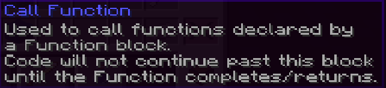
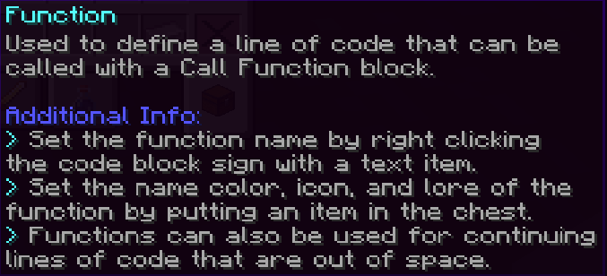
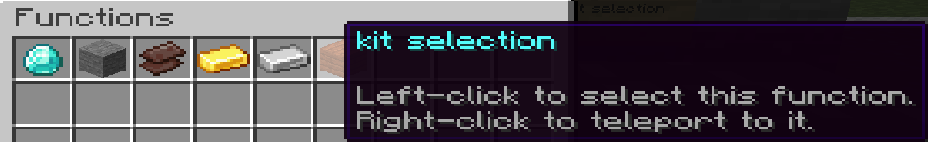
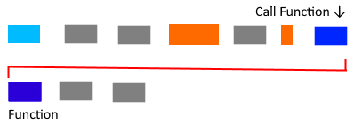
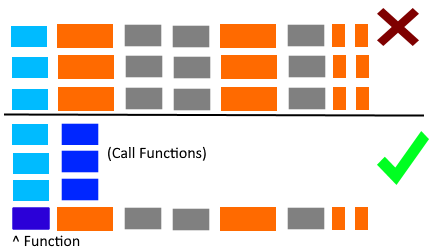
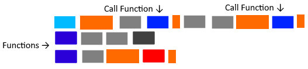

# Functions

This guide will teach you how to use the **Function** and **Call Function** code block.

Functions are an important part of DiamondFire. They're one of the most important features, and an integral part of larger, more complicated code constructions.

## How to use and apply Functions

Functions work in two parts: Call Function, and the Function itself. The code logic behind is very simple. You are calling your function, basically a "warp" over to your function, then as soon as the function is read, it returns to the original line of code (the exact place it was called). Function usage is further explained through the images in the next paragraph.

You can also name functions to stay organized by right clicking the **Function** with the name of your function first using a [Text item](Variables/Text.md), then right clicking your Call Function last. You can also change the icon of your function by putting the item you want to use in the **Function** chest for extra organization.

## Applications of Functions

Basic use of Functions: Continuing lines after you run out of space

  
  
Funneling multiple lines into one function to save large (or short) amounts of time

  
  
One long "main" line with "pocket warps" for different sections of the line

!> **Note:** Functions are *not* async, so the main line will be read up until it hits a function, then read the function. It will not read both lines at the same time, no matter what. It will always read the function first before continuing, no matter what. For asynchronous code and Processes, click [here](Code_Blocks/Processes.md).
