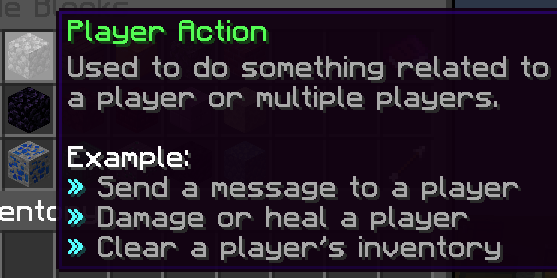

# Player Action

A **Player Action** code block (represented by cobblestone) is used for applying actions to players.

You can find a list of clickable links to articles describing actions in the Player Action block below.

## Table of Contents

- Item Management
    - [Give Items](Code_Blocks/Player_Action/Give_Items.md)
    - [Set Hotbar Items](Code_Blocks/Player_Action/Set_Hotbar_Items.md)
    - [Set Inventory Items](Code_Blocks/Player_Action/Set_Inventory_Items.md)
    - [Set Item in Slot](Code_Blocks/Player_Action/Set_Item_in_Slot.md)
    - [Set Equipment Item](Code_Blocks/Player_Action/Set_Equipment_Item.md)
    - [Set Armor Items](Code_Blocks/Player_Action/Set_Armor_Items.md)
    - [Replace Items](Code_Blocks/Player_Action/Replace_Items.md)
    - [Remove Items](Code_Blocks/Player_Action/Remove_Items.md)
    - [Clear Items](Code_Blocks/Player_Action/Clear_Items.md)
    - [Clear Inventory](Code_Blocks/Player_Action/Clear_Inventory.md)
    - [Set Cursor Item](Code_Blocks/Player_Action/Set_Cursor_Item.md)
    - [Save Current Inventory](Code_Blocks/Player_Action/Save_Current_Inventory.md)
    - [Load Saved Inventory](Code_Blocks/Player_Action/Load_Saved_Inventory.md)
    - [Set Item Cooldown](Code_Blocks/Player_Action/Set_Item_Cooldown.md)
- Communication
    - [Send Message](Code_Blocks/Player_Action/Send_Message.md)
    - [Send Message Sequence](Code_Blocks/Player_Action/Send_Message_Sequence.md)
    - [Send Message with Hover](Code_Blocks/Player_Action/Send_Message_with_Hover.md)
    - [Show Title Text](Code_Blocks/Player_Action/Show_Title_Text.md)
    - [Show Action Bar Text](Code_Blocks/Player_Action/Show_Action_Bar_Text.md)
    - [Open Book](Code_Blocks/Player_Action/Open_Book.md)
    - [Set Boss Bar](Code_Blocks/Player_Action/Set_Boss_Bar.md)
    - [Remove Boss Bar](Code_Blocks/Player_Action/Remove_Boss_Bar.md)
    - [Send Advancement](Code_Blocks/Player_Action/Send_Advancement.md)
    - [Set Player List Info](Code_Blocks/Player_Action/Set_Player_List_Info.md)
    - [Play Sound](Code_Blocks/Player_Action/Play_Sound.md)
    - [Stop Sounds](Code_Blocks/Player_Action/Stop_Sounds.md)
    - [Play Sound Sequence](Code_Blocks/Player_Action/Play_Sound_Sequence.md)
- Inventory Menus
    - [Show Inventory Menu](Code_Blocks/Player_Action/Show_Inventory_Menu.md)
    - [Expand Inventory Menu](Code_Blocks/Player_Action/Expand_Inventory_Menu.md)
    - [Set Inventory Menu Item](Code_Blocks/Player_Action/Set_Inventory_Menu_Item.md)
    - [Set Inventory Menu Name](Code_Blocks/Player_Action/Set_Inventory_Menu_Name.md)
    - [Add Inventory Menu Row](Code_Blocks/Player_Action/Add_Inventory_Menu_Row.md)
    - [Remove Inventory Menu Row](Code_Blocks/Player_Action/Remove_Inventory_Menu_Row.md)
    - [Close Inventory](Code_Blocks/Player_Action/Close_Inventory.md)
    - [Open Container Inventory](Code_Blocks/Player_Action/Open_Container_Inventory.md)
- Statistics
    - [Damage](Code_Blocks/Player_Action/Damage.md)
    - [Heal](Code_Blocks/Player_Action/Heal.md)
    - [Set Current Health](Code_Blocks/Player_Action/Set_Current_Health.md)
    - [Set Maximum Health](Code_Blocks/Player_Action/Set_Maximum_Health.md)
    - [Set Absorption Health](Code_Blocks/Player_Action/Set_Absorption_Health.md)
    - [Set Food Level](Code_Blocks/Player_Action/Set_Food_Level.md)
    - [Set Saturation Level](Code_Blocks/Player_Action/Set_Saturation_Level.md)
    - [Give Experience](Code_Blocks/Player_Action/Give_Experience.md)
    - [Set Experience](Code_Blocks/Player_Action/Set_Experience.md)
    - [Give Potion Effect](Code_Blocks/Player_Action/Give_Potion_Effect.md)
    - [Remove Potion Effect](Code_Blocks/Player_Action/Remove_Potion_Effect.md)
    - [Clear Potion Effects](Code_Blocks/Player_Action/Clear_Potion_Effects.md)
    - [Set Hotbar Slot](Code_Blocks/Player_Action/Set_Hotbar_Slot.md)
    - [Set Base Attack Speed](Code_Blocks/Player_Action/Set_Base_Attack_Speed.md)
    - [Set Fire Ticks](Code_Blocks/Player_Action/Set_Fire_Ticks.md)
    - [Set Remaining Air](Code_Blocks/Player_Action/Set_Remaining_Air.md)
    - [Set Invulnerability Ticks](Code_Blocks/Player_Action/Set_Invulnerability_Ticks.md)
    - [Set Fall Distance](Code_Blocks/Player_Action/Set_Fall_Distance.md)
    - [Set Movement Speed](Code_Blocks/Player_Action/Set_Movement_Speed.md)