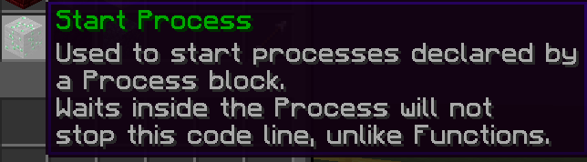

# Processes

This guide will teach you how to use the **Process** and **Start Process** code block.
We recommend reading the [Functions](Code_Blocks/Functions.md) first, but this is not necessary.

What do they do, and how and when should you use them? This guide will teach you all that.

## Setting it up

There are two blocks: the **Start Process** block; an emerald ore, and the **Process** block; an emerald block.

A **Process** is similar to a Function (the lapis lazuli block), it is a line of code in front of a block which you give a name. In this case, this is the **Process** name, not the **Function** name. It can be anything, just make sure you can remember it later for your own convenience.

The <u>only</u> way a line of code starting with a **Process** block can be executed is using a **Start Process** block.

Let's talk about the **Process** one first. We've just learned it has to be placed in front of the code it runs.
We can define what name your unique **Process** should have using a [Text item](Variables/Text.md). You can right-click the sign of the Process block while holding the text item to set the name of it.

Good job! You have created a Process!

You may have noticed the Process block having a chest. You can optionally put an item in here to give the Process an icon. It will also give you the option to hide the process, useful for internal processes. This is purely for easily finding your processes again later. It is completely optional.

<u>Now, let's talk about the **Start Process** block.</u>

A process can be called anywhere. For example, on [Player Event: Join Game](Code_Blocks/Player_Event/Join_Game.md). However, the block has some rather interesting options. Let's take a closer look.

First up, we should define what process we are going to start. It can be done similarly to how we set the name for the process before. Make sure it has exactly the same name. Alternatively, you can right click the sign to show a menu of all non-hidden processes.

When the block of code is run, it will act just like a fork. Before it, there is one line of code running. After it, it splits into two lines of code, just like a fork upside-down. Any code after the block will run simultaneously to the process started (asynchronous). This is the opposite of a function, a line of code will pause completely at a **Call Function** block until the function called has completed executing.

## Tags

The **Start Process** has a chest as well! This time, nothing can be put inside. At least, it won't do anything, but the chest is there for a reason.

When opening the chest, you will see two items or settings, so-called "tags". You can toggle between the options by clicking on the items.

<u>**Tag: Local Variables**</u>

Option | Description
--- | ---
Don't copy | Do not copy any local variables over to the new thread, making them unusable inside the process
Copy | Copy all local variables over to the new thread, making them available inside the process. Local variables changed inside the process will remain unchanged in the thread it was started from.
Share | Same as copy, except, changes to the local variables are shared across the threads.

<u>**Tag: Target Mode**</u>

We recommend reading the [Event Targets](Other/Code_Related/Event_Targets.md) guide before reading about this tag.

Option | Description
--- | ---
With current targets | All current targets will be carried over, and if the default target is removed, the process stops. What this essentially means is, all targets currently available (default, and if applicable, damager, victim, etc) will still work in the process. However, it requires the default target to keep it alive. If the default target leaves the plot and the process is running, it will stop.
With current selection | All non-override targets will not be available in this process (override targets: selection and all mobs/entities/players). This makes the default target unavailable aswell, and as such, the process will keep running (unless it ends the line of code) for as long as there is at least 1 player on the plot. Keep in mind: All non-override targets are unavailable. Make sure to use an override target on blocks that make something happen or check a specific something by sneak+right clicking the sign. The current selection before the process is called will still be selected inside of the process, unless it is deselected.
With no targets | Same as above, except, the selection is not carried over.
For each in selection | Starts a process for everything in the current selection and carries over that default target. For example, I have a selection with the players RyanLand and Jeremaster. After this, I start the process with this option selected. A process will be started for us both, and the default target in the process is the one running it. However, because a default target is available, like option 1, the process will stop executing if the player leaves the plot. For example, if I leave the plot, my process would stop, but Jeremaster's process would keep going.

## When to use

You should ALWAYS use functions, unless you are 100% positive you need a process and what you are trying to do is not possible with a function. Execution speed should not be a factor in your decision between a process and a function.

Processes can be used for a variety of things. Often, it is used for plot loops, player loops, managers, updaters, game hosting systems, and more. Mainly repeats, as you can see.

You should avoid splitting your code into multiple processing threads. This would be more efficient in traditional programming, but due to the way DiamondFire processes work, this will result in only making the code run slower instead of faster.

!> **Note for advanced developers:**
Processes are not truly asynchronous. They become asynchronous upon encountering a wait, they function like a function until a wait is triggered.
As code without waits triggers almost instantly, you shouldn't notice or do anything of this info.

