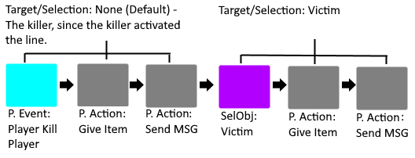

# Select Object

Select Object is quite niche in terms of where it can be applied, but it is still nonetheless required in those situations. **Select Object** brings an extensive amount of clarification to your code when it is most needed, which makes it an important addition to your Batman coding 
utility belt! This guide will show you the ins-and-outs of Select Object, and provide some of its applications and purposes as well.

## How to use Select Object

Select Object uses targets, it may be handy to read the [Event Targets](Other/Code_Related/Event_Targets.md) first.

Select Object is an efficient way of targeting specific entities and/or players through direct means or through conditional statements. The "target" is whatever or whoever the code is applying to, be it an entity, player, or neither (in which case there would be no target). There can also be multiple targets, depending on which selector you are using. Some **Select Object** selectors require no parameters, while others require one or more. Here is a list of all the Select Object selectors, including the amount of parameters each of them have.

Select Nothing (0 Chest Parameters)
Select Default Player (0 Chest Parameters)
Select Default Entity (0 Chest Parameters)
Select Random Player (0 Chest Parameters)
Select Random Mob (0 Chest Parameters)
Select Random Entity (0 Chest Parameters)
Select All Players (0 Chest Parameters)
Select All Mobs (0 Chest Parameters)
Select All Entities (0 Chest Parameters)
Select Last-Spawned Mob (0 Chest Parameters)
Select Last-Spawned Entity (0 Chest Parameters)
Select Killer (0 Chest Parameters)
Select Select Damager (0 Chest Parameters)
Select Shooter (0 Chest Parameters)
Select Projectile (0 Chest Parameters)
Select Victim (0 Chest Parameters)
Select Player by Name (1 Chest Parameter)
Select Mobs by Name (1 Chest Parameter)
Select Entities by Name (1 Chest Parameter)
Filter Selection Randomly (1 Chest Parameter)
Filter Selection by Distance (2 Chest Parameters)
Select Players by Condition (Conditional)
Select Mobs by Condition (Conditional)
Select Entities by Condition (Conditional)
Filter Selection by Condition (Conditional)

## How to apply Select Object

Select Object is relatively easy to apply in your code. The default target for your code is None, which it does not mean what it implies. Code without a target will still run normally, as if you had never changed anything in the first place. That means, in the majority of cases, code with no target will target the Default player or entity ("Default" is whoever activated the line of code). When you select an object, that selection will remain the same unless changed until the entire thread (including functions) has been read, with the exception of processes (See: [Processes](Code_Blocks/Processes.md)).

## Applications of Select Object

Select Object has many uses in complicated constructions, including, but not limited to, queue systems, game starts, random player selections, and long lines of code including the targeting of multiple entities and/or players.

!> Another similar feature is the Player and Entity Action Targets. They contain similar target selectors (not nearly as many though).
