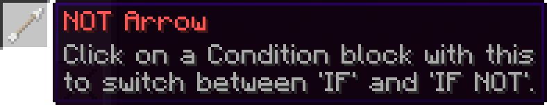
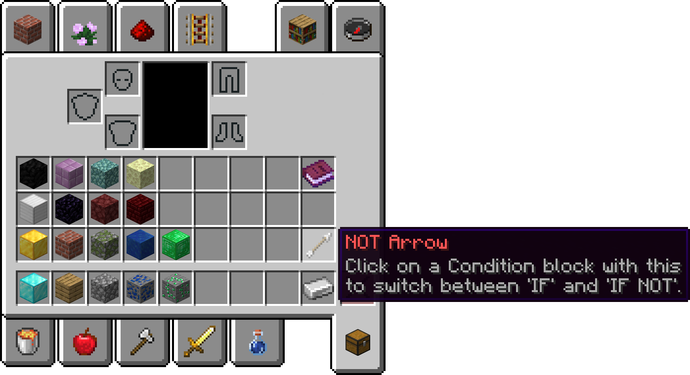
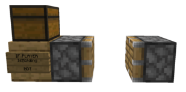
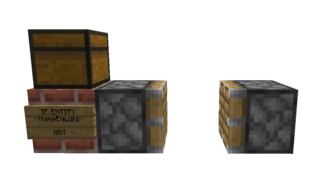
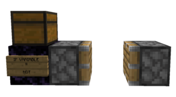
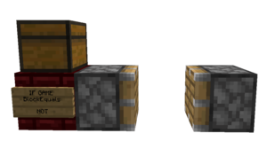
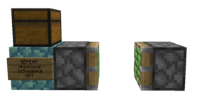
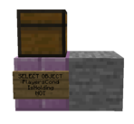
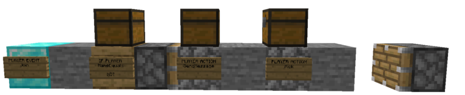

# Not Arrow
The Not Arrow (sometimes called Not Stick) is an item that changes a condition block from detecting if something is happening to detecting if something is not happening. It's similar to using an else block without needing an original condition block.

## Usage
To use the Not Arrow (found in the bottom right slot of your inventory, as shown below), you need to have a condition block ([If Player](Code_Blocks/If_Player.md), [If Entity](Code_Blocks/If_Entity.md), [If Variable](Code_Blocks/If_Variable.md), or [If Game](Code_Items/If_Game.md)) placed down, and you need to right-click while looking at the condition block with a Not Arrow. Do it again to remove the 'Not' tag.

This item can be used in many different ways. It runs the same way that an else block would if it were attached to the end of a condition block. This conserves space and allows for quicker, easier coding.

### Condition Blocks
Condition blocks, usually called If-blocks, are bits of code that run only if something is happening. Condition blocks are the blocks that are compatible with the Not Arrow, but there are also other positions where a condition block isn't placed, but you could still use the Not Arrow.

#### Select Object and Repeat

If you wanted to select every person who does not have an iron pickaxe, you would use [Select Object: Players By Condition](Code_Blocks/Select_Object/Players_By_Condition.md). This opens a menu where you can select a condition block and a condition within it. Once you've gone through the menu, you'd use the Not Arrow on the [Select Object](Code_Blocks/Select_Object.md) to swap it to a Not condition. You can also use the Not Arrow on Repeats. If you wanted to have something loop only when a player isn't sneaking, you would use [Repeat: While](Code_Blocks/Repeat/While.md). This does the same as [Select Object: Players By Condition](Code_Blocks/Select_Object/Players_By_Condition.md) and opens up a menu where you can select a condition block and a condition within it. Once you've gone through the menu, you'd use the Not Arrow on the Repeat to swap it to a Not condition. Examples of each condition block, as well as the [Repeat](Code_Blocks/Repeat.md) and [Select Object](Code_Blocks/Select_Object.md), can be seen on the right.

## Examples

### Different Blocks

     

### Kick Whitelist

One use that is very common is a kick whitelist, which is for ranks [Noble](Other/Noble.md) and above only. Basically, you would place an [If Player](Code_Blocks/If_Player.md) and select [If Player: Name Equals](Code_Blocks/If_Player/Name_Equals.md). Then, you would apply the Not Arrow to the [If Player](Code_Blocks/If_Player.md) and put your own name (and anyone else whitelisted) into the [If Player](Code_Blocks/If_Player.md)'s input chest. Finally, inside of the [If Player](Code_Blocks/If_Player.md)'s brackets, you would put a [Player Action: Kick](Code_Blocks/Player_Action/Kick.md) and [Player Action: Send Message](Code_Blocks/Player_Action/Send_Message.md). This allows you to kick a player when they join your plot and send them a message describing why they were kicked. The end result would look like this:

