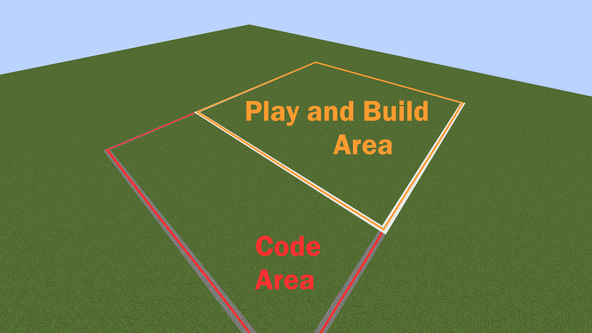
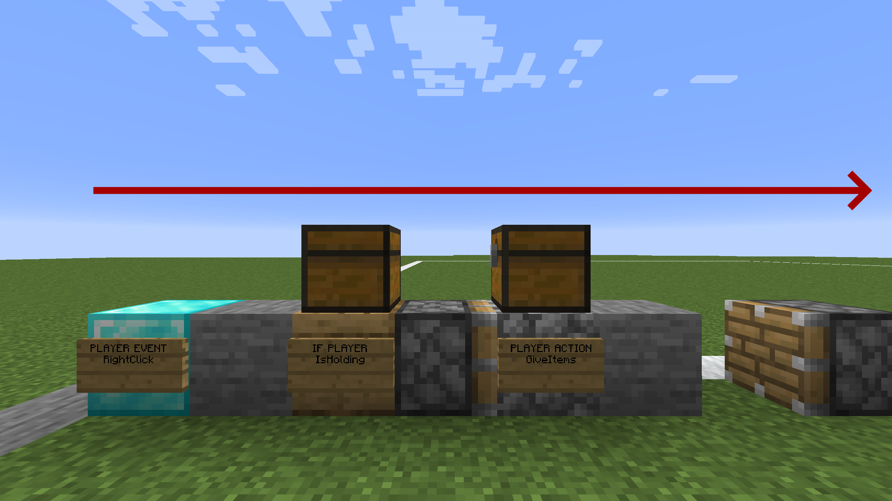

# Getting Started

This guide explains the basics of coding on DiamondFire.

## Plots

The server is divided into plots of land. Each plot has two different areas; one is the play/build area while the other is the code area. The play/build area is square and typically surrounded by wool blocks, while the code area is smaller, rectangular, and surrounded by stone blocks.

### Plot Modes

There are 3 different modes in a plot: `dev`, `build` and `play`:

Play mode is the mode where gameplay takes place. Plot code is executed on players in this mode. Players cannot leave the bounds of the play area while in play mode. By default, anyone can play your plot.
Build mode is where players can build freely in the play area to create the gameplay environment. Players may only enter build mode on a plot if they own the plot, or have been granted permission by the plot owner. Permissions can be managed with `/plot builder <add/remove> <player>`.
Dev mode, also known as code mode, is where players can edit the plot's code, which determines the game logic. Players may only enter code mode on a plot if they own the plot, or have been granted permission by the plot owner. Permissions can be managed with `/plot dev <add/remove> <player>`.
To access these modes, type `/mode <dev/build/play>`, or use the shortcut commands: `/dev`, `/build`, `/play`. To leave a plot and return to spawn, use `/leave` or `/spawn`.

## Code

Code is represented by blocks in the code area of your plot. Different block types correspond to different programming concepts, such as events, if statements, functions, and actions. When you enter dev mode, you will find these special code blocks in your inventory. When you place one, you will notice a sign on the front of the block, listing its type (e.g. "PLAYER EVENT"). You can then select the specific event/action/etc that you want to use by right clicking the sign and choosing from the menu that appears.

Code execution begins with an event block and continues to the right, executing the blocks in order.

### Parameters and Variables

Many code blocks take in parameters. For example, [Player Action: Damage](Code_Blocks/Player_Action/Damage.md) takes in a number to determine how much to damage the player. You'll notice that there is a chest located on top of these code blocks; you will place items in this chest to specify the parameters. To represent numbers, text, sound effects, locations, and other variable types, you'll need to open the Variable Items menu. This is done by right clicking while holding the iron ingot, which is in the code mode inventory. From this menu, you can select an item depending on which variable type you need. Hovering over these items will display a description of how to set their values (for example, a text item's text can be set by holding it and typing the text into chat).

### Object Selection

When executing code such as a [Player Action](Code_Blocks/Player_Action.md), DiamondFire will infer the target player automatically; the default is generally the player or entity that triggered the event. However, there are times when you may wish to target a different player or entity, or execute code on several players/entities at a time. The [Select Object](Code_Blocks/Select_Object.md) block provides this functionality. See [Event Targets](Other/Code_Related/Event_Targets.md) for more information.