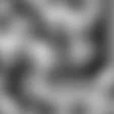

# Terrain Generator

A terrain generator is simply something that places down columns of blocks that have similar height to one another. This can easily be achieved by using something called *Perlin Noise*.

Noise is another way of saying random or randomness. Perlin Noise, however, is a special type of noise called *Cohesive Noise*. This means in a field made up of perlin noise, two values that are next to one another in that field are very similar.



Because of this, if perlin noise is used as the heights of the columns, then it will look like a wavey, hilly terrain. But before perlin noise can be used as the heights for the columns, you have to do some math on it. The first step, is to take a perlin noise value and multiply it by the *maximum change in height* of the column in blocks. The second step is to take that newly found value and add the *minimum y value* to it. Once both these steps are finished, you can place down a column with its height at this newly found value. The last step is to repeat it for every column in your generator.

## Implementation (Pseudocode)

```
// Define the two bounds of the generated terrain;
// note that the Y values must be the same
var pos1 = location{0,49,0}
var pos2 = location{51,49,51}

// Get the initial X value for pos1
var.getCoord(originX, pos1, coord:x)

// Set the maximum height the terrain can go to, note that this is added onto the
// minimum height of the terrain
var maxHeight (number) = 25
// Set the minimum height for the terrain to the Y value of pos1
var.getCoord(minimumHeight, pos1, coord:y)

// Create a random seed for the noise, making it random every time we generate
var seed (number) = %random(-100000,100000)`

// Iterate through every block between the locations pos1 and pos2
repeat grid(noiseLocation, pos1, pos2)

    /* Calculate the perlin value of the current location of the iteration
    
    Parameters: 
    - Variable to set
    - Noise location (current location)
    - Frequency (scale, or how much the noise is stretched) = 1
    - Octaves = 4 (this will affect the amount of layers of perlin noises there will be, thereby affective how blurry/fine the final map will be.)
    - Frequency gain per octave = 1.5 (how close octave layers will be to eachother)
    - Amplitude gain per octave = 0.75 (how extreme values will change, the higher, the flatter)
    - Seed (random seed)
    */
    var.perlin(perlinValue, noiseLocation, 1, 4, 1.5, 0.75, seed)
        
    // Multiply the perlin noise by the maximum height value
    var perlinValue = perlinValue * maxHeight;
    // Add the minimum height to the calculated value
    var perlinValue += minimumHeight
        
    // Create a location at the current location within the repeat, but with its Y set to the calculated perlin value
    var.setCoord(topLocation, noiseLocation, perlinValue, coord:y)
    
    // Place a stone pillar
    game.setBlock(noiseLocation, topLocation, "stone")
    game.setBlock(topLocation, "grass_block")
        
    // Wait as little as possible to avoid the "fast looping" LagSlayer halt
    control.wait(0)
```