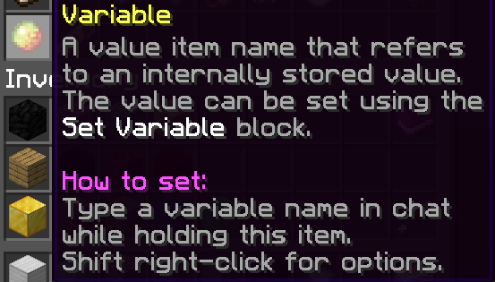
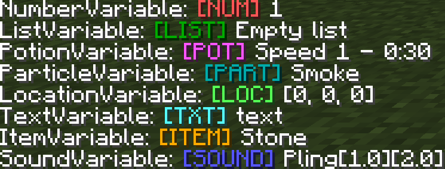

# Variables

Variables represent a data value that can be used in code blocks as parameters. Variables can be broken up into different variable types and depending on the type have different ways they can be used. Some variable types can be represented as Variable Items, while some of them can only be represented inside of dynamic variables. Variables are represented as a magma cream and can be manipulated using the [Set Variable](Code_Blocks/Set_Variable.md) code block.

You can find a list of all [Set Variable actions here](Code_Blocks/Set_Variable.md).

## Variable Types

There are different types of variables. Here's a list, clicking them will give more detail:
* [Text](Variables/Text.md)
* [Number](Variables/Number.md)
* [Location](Variables/Location.md)
* [Sound](Variables/Sound.md)
* [Particle](Variables/Particle.md)
* [Potion Effect](Variables/Potion_Effect.md)
* [Game Value](Variables/Game_Value.md)
* [Vector](Variables/Vector.md)
* [List](Variables/List.md)
* [Item](Variables/Item.md)

## Item

Dynamic variables can be obtained through the [Values](Code_Items/Values.md) menu or by typing `/var <dynamic string> <stack size> [-s] [-l]`. The arguments -s or -l represent the scope that the variable is in. A dynamic variable's name can be set by holding the item and typing in chat. Sneak + right-click to set the scope of the dynamic variable and shift + left click to edit the name of the dynamic variable.



### NBT Format

This is the NBT format of the variable item. This data is read and processed in order for code to determine if the item is a variable or not. You can see this data in realtime by typing the command `/itemdata`.
```
{"id":"var","data":{"name":"Dynamic Variable","scope":"unsaved"}}
```
- "name" represents the name of the variable that it is set to.
- "scope" represents if the variable is local, saved or unsaved.

## Usage

When a variable is in its item form, that data can be set to a variable by using the [Set Variable](Code_Blocks/Set_Variable.md) code block. When a variable is created, the name and scope of the dynamic variable item will determine the name and scope of the variable. Note that, if you try to access a variable that either you are not allowed to access because of the scope or just doesn't exist you will be given the number value 0. Variables can be used to replace any argument requested in a code block. The only thing to keep in mind, the variable must be the same value type as the parameter requested. For example, you cannot damage a player for a variable that equals the text value "hi", however you can if it has any number value like 1. Any argument that contains an (s) can be replaced with a list or a large amount of [Values](Other/Code_Related/Values.md).

### Scopes

A variable has 3 different scopes. These scopes effect when the variable should be deleted and where it should be accessed. For example, you can only access a local variable in the event it was created in. Trying to access that variable in a different event will give you value 0.

Scope | Description
--- | ---
Local | Exists until the thread that it is created in has been completed.
Game | Exists until everyone has left the plot.
Save | Exists until cleared manually, persisting even after everyone has left the plot.

## Commands

Dynamic Variables are also able to be viewed by using commands. Commands allow you to debug or purge large amounts of variables.
`/p` is a shortcut for `/plot`.

### /plot vars

The command `/plot vars` allow you to list all currently active variables and information such as their scope, value and name.



The format for the `/plot vars` command: 
```
[SCOPE] Variable Name: [Variable Type] Value
```

### /plot varpurge [name]

`/plot varpurge` allows you to clear any active variable on your plot. This command can be used to remove any type of variable you want, including SAVED variables.

This command allows you to clear variables only with a certain name, like this: `/plot varpurge [name]`.

*Please note, variables that have been deleted with this command **cannot** be retrieved again.**

## Variable Limits

Each plot has a limit to how much variables it can have stored at a time. The limits are listed below:

Scope | Limit
--- | ---
Local | 50,000 local variables per event
Game | 500,000 variables

Once you reach these limits, you will not be able to create any new variables of that type.