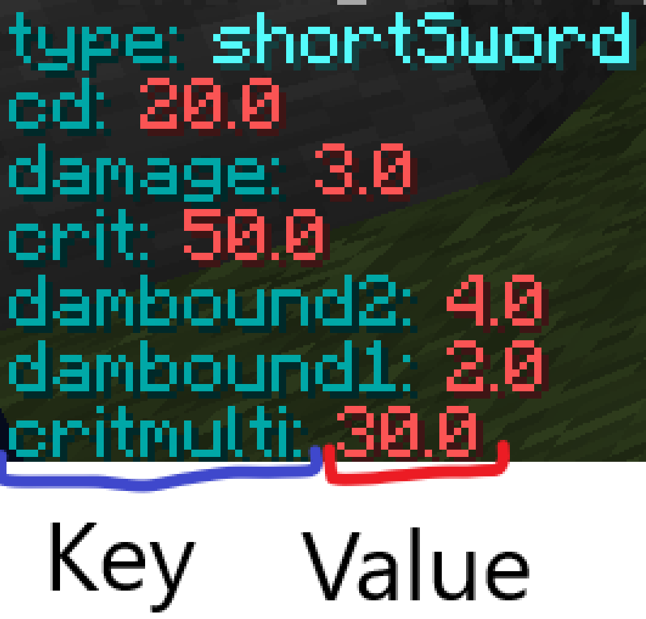
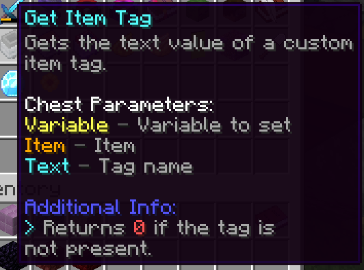
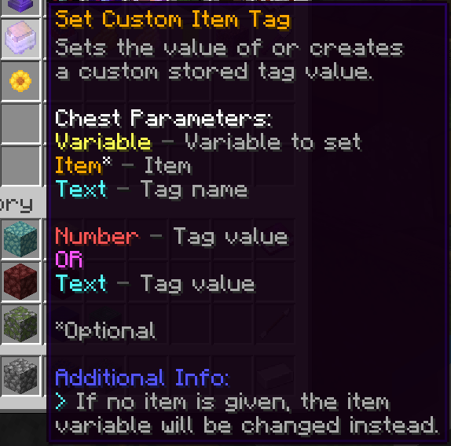
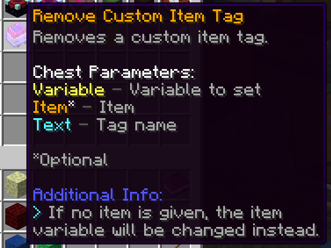

# Item

An Item variable can only be set using [Dynamic Variables](Variables.md).

It can be created and manipulated using [Set Variable actions](Code_Blocks/Set_Variable.md) under the **Item Manipulation** category.

## Item Tags

Item tags save data inside items, called tags. They work by just storing a **key** and a **value**. Today you'll learn how to use item tags effectively and how they can be used to make your life 10x easier.

### How do I use Item Tags?

You can set an item's tag by using commands. Here's a list:

Command Syntax | Description
--- | ---
/item tag set <key> <value> | Keep in mind that the key has to be all lowercase, whereas the value can be anything.
/item tag remove <key> | Removes a tag with the matching key.
/item tag clear | Removes all tags on your item.

Additionally, you can use [Set Variable actions](Code_Blocks/Set_Variable.md) to also modify item tags.

There are also entity tags, which function basically the same as Item Tags.

### What can I use Item Tags for?

Item tags can be used for a very wide array of things, from modifying pet's stats to making custom damage systems to creating a custom car system, the possibilities are virtually endless. 
