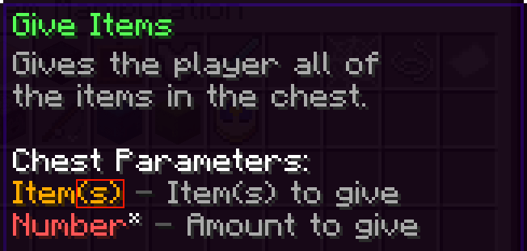

# List

Lists are a variable type that represents a collection of other variables types. Each [variable](Variables.md) added to a list is called a "value" and each value is assigned a number called an "index." A list's indices start at 1 and are limited to 10,000 meaning there is at most there can be 10,000 values in a list. When a list is first created it is represented as an "Empty List".

## Creating a List

You create a list by placing a named dynamic variable in [Set Variable > List Manipulation > Create List](Code_Blocks/Set_Variable/Create_List.md) and from there you can leave the inventory empty (creating an empty list) or add any default values you would like to have.

## Using and Manipulating lists

Lists can be found in many different places for many different uses (eg. Item lores, command arguments, inventory items). `Set Variable > List Manipulation` grants you with many ways to edit and pull information from lists (eg. [Set Variable: Append Value](Code_Blocks/Set_Variable/Append_Value.md) - Adds one or more values to the end of a list.)

### Grabbing values from a list

Because each element added to a list is assigned an index, the only way to access that element is to get it from its index.

For example, the sound variable item will be assigned to index 2 in the list.

Ways you can fetch values from a list can be [Set Variable > List Manipulation > Get List Value at Index](Code_Blocks/Set_Variable/Get_List_Value_at_Index.md) or by using `%index(list,index)` inside of text variables.

### Code block parameters

Lists can also be used inside of code blocks as arguments instead of using multiple [Values](Other/Code_Related/Values.md). Because lists are not represented as an item, the only way to use them is by using a dynamic variable. An easy way to tell if an argument supports a list is if the argument type has an (s) at the end of it.

Please note that you cannot mix variable items and lists together or use multiple lists.

