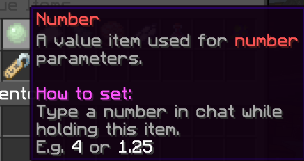

# Number

Number variables are variables that represent a decimal number. They are represented by slime balls.

Number items can be obtained through the Variable Items menu or by typing `/num <dynamic string> <stack size>`.

To set the decimal of a number item, hold the slime ball in your main hand and type the value in chat. The value will not be sent out in chat.

Numbers cannot have more than **3** decimals. The code parser will not read any decimal beyond this point.

## NBT Format

`{"id":"num","data":{"name":"0"}}`

- "num" represents the number that the item is set to.