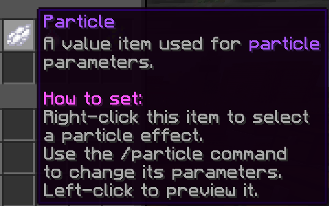
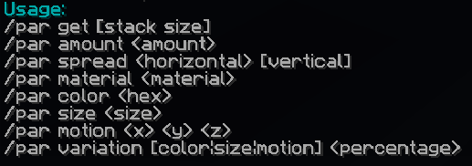
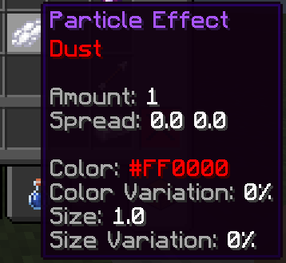

# Particle

A particle variable contains a (modified) Minecraft particle with additional parameters. It is represented by a white dye.

Right-click whilst holding the item to set its particle. While hovering over the selected particle, you will see all parameters this specific particle has to offer. These can be modified using the **/particle** or **/par** commands.

You can preview your particle by left-clicking with it.

## NBT Format

`{"id":"part","data":{"particle":"Dust","cluster":{"amount":1,"horizontal":0.0,"vertical":0.0},"data":{"rgb":16711680,"colorVariation":0,"size":1.0,"sizeVariation":0"}}}`
`{"id":"part","data":{"particle":"Soul Flame","cluster":{"amount":1,"horizontal":0.0,"vertical":0.0},"data":{"x":1.0,"y":0.0,"z":0.0,"motionVariation":100}}}`

*Note: this NBT may be different per particle type*

- "particle" represents the particle type.
- "amount" represents the amount of particles.
- "horizontal" represents the horizontal spread number.
- "vertical" represents the vertical spread number.
- "data": extra data
  - "rgb" represents the particle color in RGB.
  - "colorVariation" represents the variation in color.
  - "size" represents the size of the particle.
  - "sizeVariation" represents the variation of the size of the particle.
  - "motionVariation" represents the variation of the motion of the particle.
  - "x" represents the motion X axis.
  - "y" represents the motion Y axis.
  - "z" represents the motion Z axis.

