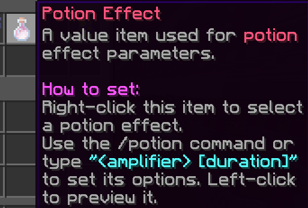

# Potion Effect

A potion effect variable is a (modified) Minecraft effect, represented by a dragon breath.

You can right-click while holding the item to set its effect.
Type numbers in chat based on the format "<amplifier> [duration]" to modify it's properties. For example, send "5 0:10" to set the potion's amplifier to 5 and the duration to 10 seconds. Instead of "0:10", you could use ticks aswell.

## NBT Format

`{"id":"pot","data":{ "pot":"Speed","dur": 600,"amp":0}}`

- "pot" is the current effect that the item has selected.
- "dur" represents the duration of the item. *This is in ticks*
- "amp" represents the amplifier of the item.