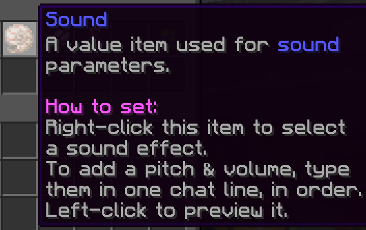

# Sound

Sounds variables are (modified) Minecraft sound effects. They can be acquired in the [Values](Other/Code_Related/Values.md) menu (right-click the iron ingot).

You can set the sound played by right-clicking the item (a shell). This will open a GUI with categorized sounds. Alternatively, type `/sound <search term>` to search for one.

You can modify the pitch of the sound by typing it out in chat. This pitch has to be in the range of 1 and 2.
The volume can be modified by adding it to the message. For example, you can set a sound's pitch to 1.6 and volume to 1.3 by typing *1.6 1.3*.

## NBT Format

`{"id":"snd","data":{"sound":"Pling","pitch":1,"vol":2}}`

- "sound" is the current sound that the item has selected.
- "pitch" represents the pitch that the sound is set to. *This is always a number between 0.0-2.0*
- "vol" represents the volume that the sound is set to.