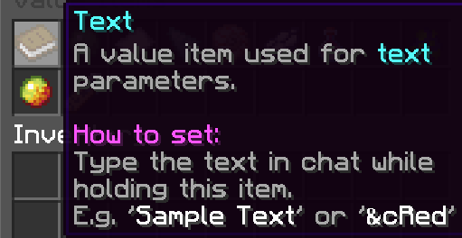

# Text

Text variables are variables that represent one or more characters (eg. "hello"). They are represented by books.

Text items can be obtained through the Variable Items menu or by typing `/text <dynamic string> <stack size>`.

To set the text of a text item, hold out the book in your hand and type the new value in chat. The new value will not be sent out in chat.

Sneak + Right Click while holding the item to preview the text in chat. Sneak + Left Click while holding the item to edit the text of the item.

## NBT Format

`{"id":"txt","data":{"name":"test"}}`
- "name" represents the text that the item is set to.