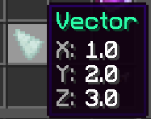
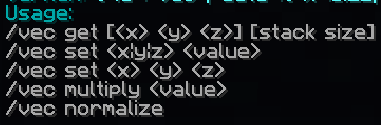

# Vector

A vector variable type represents 3 components: X, Y and Z.
You can see vectors as a line from point A to B (basically, a vector is direction and magnitude combined). A will be *(0,0,0)* in this example. If our vector is *<3,3,3>* the vector is a straight line from *(0,0,0)* to *(3,3,3)*. To easily visualize this, set a vector and left-click while holding it.

You can set a vector's components by typing "<x> <y> <z>" in chat while holding it. For example, "1 2 3" will produce this vector:

Shift + Left-click to launch yourself in the vector's direction.

You can modify the vector's components by using commands as well. Here is a list:

Vectors are exactly like vector maths. Vectors can be modified using [Set Variable actions](Code_Blocks/Set_Variable) under the **Vector Manipulation** category.

## NBT Format

`{"id":"vec","data":{"x":1.22,"y":3.44,"z":5.66}}`

- "x" represents the X component in a vector.
- "y" represents the Y component in a vector.
- "z" represents the Z component in a vector.